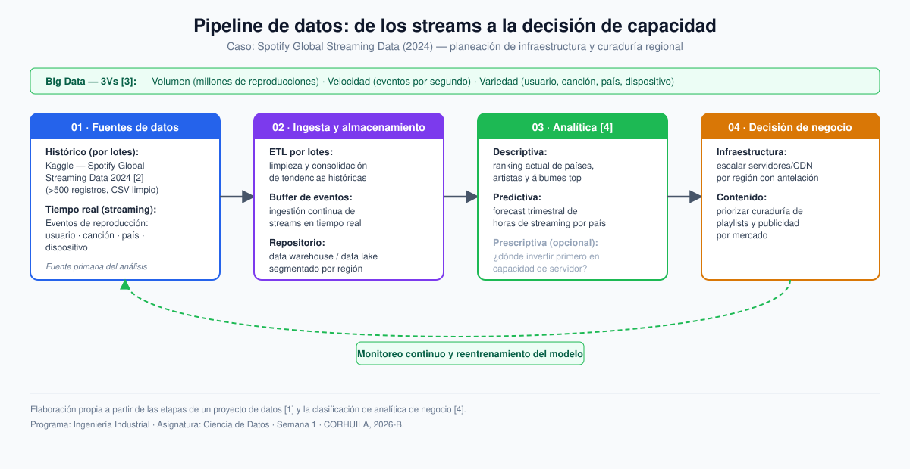
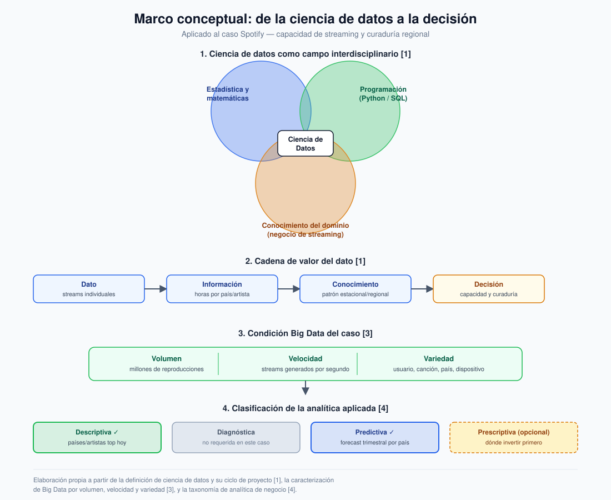

# Semana 1 — Encuadra un proyecto de datos

**Programa:** Ingeniería Industrial · **Asignatura:** Ciencia de Datos
**Unidad 1:** Fundamentos de Ciencia de Datos y Big Data · **Periodo:** 2026-B
**Modalidad:** Individual/parejas · **Tipo:** Formativa (sin nota)

> Sector elegido: **Servicios (streaming musical)**. Spotify es un servicio digital —no una industria física—, lo que amplía el enunciado de la guía hacia el sector servicios y permite ilustrar, con un solo caso, las tres propiedades clásicas del Big Data (volumen, velocidad y variedad) [3].

---

## 1. Pregunta de negocio

> **¿En qué países y en qué momentos del año aumentará la demanda de streaming en Spotify, de modo que el equipo de infraestructura pueda escalar la capacidad de servidores/CDN con antelación y el equipo de contenido pueda decidir qué artistas y álbumes promocionar en cada región?**

La pregunta es **clara y accionable**: define una unidad de análisis (país × periodo del año), una métrica observable (horas de streaming) y dos decisiones concretas y medibles que se derivan directamente de la respuesta (capacidad técnica y curaduría comercial), siguiendo el criterio de que una buena pregunta de negocio debe poder traducirse en una acción de la organización [1].

---

## 2. Datos y fuentes

| Atributo | Descripción |
|---|---|
| **Fuente principal** | *Spotify Global Streaming Data (2024)*, conjunto de datos público en Kaggle [2] |
| **Cobertura** | Tendencias globales de streaming: horas escuchadas, países, artistas y álbumes más reproducidos, comportamiento de usuarios |
| **Volumen** | Más de 500 registros estructurados, en formato CSV limpio (sin duplicados) |
| **Variables clave** | País, artista/álbum, horas de reproducción, dispositivo, patrón de comportamiento del oyente |
| **Fuente complementaria (opcional)** | Eventos de reproducción en tiempo real (usuario, canción, país, dispositivo), simulando el flujo continuo que en un entorno productivo alimentaría el mismo pipeline |

Estos datos son **pertinentes** porque cubren exactamente las tres dimensiones que exige la pregunta: geografía (país), tiempo (tendencia/estacionalidad) y contenido (artista/álbum), sin necesidad de fuentes adicionales para responderla en un primer corte.

### ¿Por qué es un caso de Big Data?

| Propiedad [3] | Evidencia en el caso |
|---|---|
| **Volumen** | Millones de reproducciones agregadas globalmente |
| **Velocidad** | Los eventos de streaming se generan en tiempo real, segundo a segundo |
| **Variedad** | Datos heterogéneos: usuario, canción, país, dispositivo, tiempo |

---

## 3. Decisión esperada

A partir del análisis, la organización podrá tomar dos decisiones **concretas**:

1. **Infraestructura:** anticipar los picos regionales de demanda para **escalar servidores y capacidad de CDN** en esos mercados antes de que ocurra el pico, evitando degradación del servicio.
2. **Contenido y marketing:** decidir **qué artistas, álbumes o playlists destacar** en cada país (curaduría y publicidad segmentada), con base en lo que ya domina el mercado y en lo que se proyecta que crecerá.

Ambas decisiones son medibles (tiempo de aprovisionamiento de infraestructura, tasa de acierto de las recomendaciones regionales) y accionables por equipos concretos de la organización (Ingeniería/DevOps y Marketing/Contenido).

---

## 4. Clasificación del tipo de analítica

Siguiendo la taxonomía de analítica de negocio [4]:

| Tipo | Pregunta que responde | Aplicación en el caso |
|---|---|---|
| **Descriptiva** | ¿Qué pasó / qué está pasando? | ¿Qué países y artistas dominan hoy el streaming global? |
| **Predictiva** *(foco principal)* | ¿Qué va a pasar? | ¿Cuánto crecerá el streaming el próximo trimestre, por país? |
| **Prescriptiva** *(opcional / extensión)* | ¿Qué debería hacerse? | ¿En qué región conviene invertir primero en más capacidad de servidor? |

El proyecto combina procesamiento **por lotes** (tendencias históricas del dataset) con la lógica de **tiempo real** propia de un servicio de streaming (eventos de reproducción segundo a segundo), lo que lo convierte en un caso representativo de Big Data aplicado a servicios [3].

---

## 5. Marco de referencia conceptual

La ciencia de datos se define como un **campo interdisciplinario** que combina métodos científicos, estadística, programación y conocimiento del dominio para extraer valor de datos estructurados y no estructurados, y así apoyar la toma de decisiones [1]. Este proyecto recorre la cadena **dato → información → conocimiento → decisión** descrita en el ciclo de un proyecto de datos [1]: los eventos individuales de reproducción (dato) se agregan en horas de streaming por país y artista (información), de donde emergen patrones estacionales y regionales (conocimiento), que finalmente habilitan una decisión de negocio.

El caso cumple, además, con las tres propiedades que caracterizan al Big Data —volumen, velocidad y variedad [3]— y se clasifica dentro de la taxonomía estándar de analítica de negocio (descriptiva, predictiva y prescriptiva) [4], con foco en la analítica **predictiva** como habilitador directo de la decisión de capacidad e infraestructura.

Los diagramas que acompañan este documento ilustran ambos marcos:

- **[`diagrama-pipeline.svg`](./diagrama-pipeline.svg)** — arquitectura/pipeline de datos: de las fuentes (histórico + tiempo real) a la decisión de negocio, con ciclo de retroalimentación.
- **[`diagrama-marco-conceptual.svg`](./diagrama-marco-conceptual.svg)** — marco conceptual: disciplinas que integran la ciencia de datos, cadena de valor del dato, condición de Big Data y clasificación de analítica aplicada al caso.

---

## 6. Referencias (formato IEEE)

[1] Corporación Universitaria del Huila (CORHUILA), "Ciencia de Datos · Semana 1 · Introducción a la ciencia de datos," Objeto Virtual de Aprendizaje (OVA), Neiva, Colombia, 2026. [Online]. Disponible: https://code-corhuila.github.io/ova-web/2026-B/ciencia-datos/01-week/01-session/

[2] A. Soundankar, "Spotify Global Streaming Data (2024)," Kaggle, 2024. [Online]. Disponible: https://www.kaggle.com/datasets/atharvasoundankar/spotify-global-streaming-data-2024

[3] D. Laney, "3D data management: Controlling data volume, velocity, and variety," META Group Research Note, Stamford, CT, USA, feb. 2001.

[4] T. H. Davenport and J. G. Harris, *Competing on Analytics: The New Science of Winning*. Boston, MA, USA: Harvard Business School Press, 2007.
