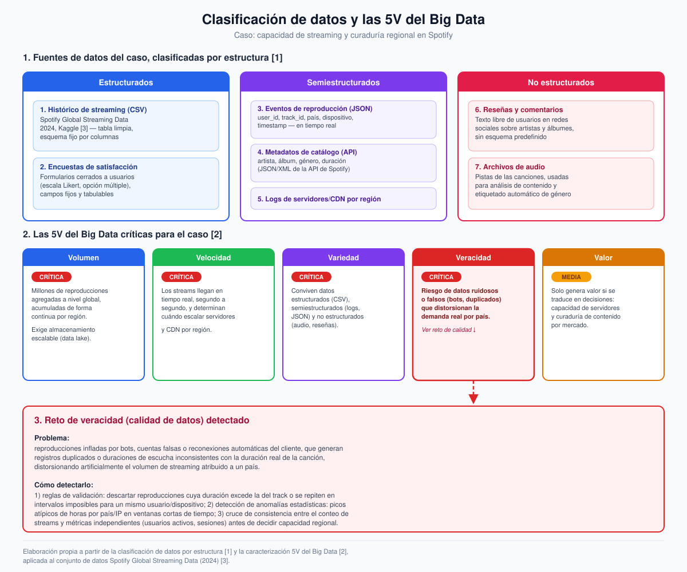

# Semana 2 — Clasifica datos y las V del Big Data

**Programa:** Ingeniería Industrial · **Asignatura:** Ciencia de Datos
**Unidad 1:** Fundamentos de Ciencia de Datos y Big Data · **Periodo:** 2026-B
**Modalidad:** Individual/parejas · **Tipo:** Formativa (sin nota)

> Continuación del caso de la Semana 1: **Spotify — capacidad de streaming y curaduría regional**. Aquí se clasifican las fuentes de datos del caso por estructura y se justifican las V del Big Data que lo hacen relevante [1], [2].

---

## 1. Fuentes de datos del caso, clasificadas por estructura

| # | Fuente de datos | Descripción | Tipo |
|---|---|---|---|
| 1 | **Histórico de streaming (CSV)** | *Spotify Global Streaming Data (2024)*, Kaggle: horas por país, artistas/álbumes top, comportamiento del oyente [3] | **Estructurado** |
| 2 | **Encuestas de satisfacción** | Formularios cerrados a usuarios (escala Likert, opción múltiple), campos fijos y tabulables | **Estructurado** |
| 3 | **Eventos de reproducción en tiempo real** | Registros JSON por cada stream: `user_id`, `track_id`, país, dispositivo, `timestamp` | **Semiestructurado** |
| 4 | **Metadatos de catálogo musical** | Artista, álbum, género y duración obtenidos vía API (JSON/XML) | **Semiestructurado** |
| 5 | **Logs de servidores/CDN por región** | Registros de tráfico, latencia y errores; formato de log con campos variables | **Semiestructurado** |
| 6 | **Reseñas y comentarios de usuarios** | Texto libre en redes sociales sobre artistas/álbumes, sin esquema predefinido | **No estructurado** |
| 7 | **Archivos de audio** | Pistas de las canciones, usadas para análisis de contenido y etiquetado automático de género | **No estructurado** |

La clasificación sigue el criterio de que un dato es **estructurado** cuando se ajusta a un esquema tabular fijo, **semiestructurado** cuando tiene organización interna (etiquetas, pares clave-valor) sin un esquema rígido, y **no estructurado** cuando carece de un formato predefinido, como texto libre, audio o imagen [1].

---

## 2. V del Big Data críticas para el caso

| V | Criticidad | Justificación |
|---|---|---|
| **Volumen** | Crítica | Millones de reproducciones agregadas globalmente y de forma continua por región exigen almacenamiento escalable (data lake) en lugar de una base de datos tradicional [2]. |
| **Velocidad** | Crítica | Los eventos de streaming se generan en tiempo real, segundo a segundo; de su procesamiento oportuno depende decidir cuándo escalar servidores y CDN por región [2]. |
| **Variedad** | Crítica | El caso combina datos estructurados (CSV, encuestas), semiestructurados (logs, metadatos JSON) y no estructurados (audio, reseñas), lo que obliga a un pipeline capaz de integrar formatos heterogéneos [1], [2]. |
| **Veracidad** | Crítica | Existe riesgo real de datos ruidosos o falsos (bots, reproducciones duplicadas) que distorsionan la demanda atribuida a un país; se detalla como reto de calidad en la sección 3. |
| **Valor** | Media | Los datos solo generan valor si se traducen en las decisiones de negocio ya definidas (capacidad de infraestructura y curaduría de contenido); sin esa traducción, el volumen y la velocidad no bastan [2]. |

Las tres primeras V (volumen, velocidad y variedad) son las originalmente propuestas para caracterizar al Big Data [2], mientras que veracidad y valor se incorporaron después como extensión del modelo para cubrir la calidad y la utilidad real de los datos en la toma de decisiones [2].

---

## 3. Reto de veracidad (calidad de datos) detectado

**Problema:** reproducciones infladas por bots, cuentas falsas o reconexiones automáticas del cliente, que generan registros duplicados o duraciones de escucha inconsistentes con la duración real de la canción. Esto distorsiona artificialmente el volumen de streaming atribuido a un país y podría llevar a escalar infraestructura donde no se necesita, o a subestimar un mercado real.

**Cómo se detectaría:**

1. **Reglas de validación:** descartar reproducciones cuya duración registrada exceda la duración real del track, o que se repitan en intervalos imposibles para un mismo usuario/dispositivo.
2. **Detección de anomalías estadísticas:** identificar picos atípicos de horas de streaming por país o IP en ventanas de tiempo muy cortas, comparados con el comportamiento histórico.
3. **Validación cruzada:** contrastar el conteo de streams contra métricas independientes (usuarios activos, número de sesiones) antes de tomar la decisión de capacidad regional.

---

## 4. Diagrama

**[`diagrama-5v-clasificacion.svg`](./diagrama-5v-clasificacion.svg)** — clasificación de las 7 fuentes de datos por estructura y caracterización de las 5V del Big Data aplicadas al caso, incluyendo el reto de veracidad detectado.

---

## 5. Referencias (formato IEEE)

[1] Corporación Universitaria del Huila (CORHUILA), "Ciencia de Datos · Semana 2 · Fundamentos de Big Data," Objeto Virtual de Aprendizaje (OVA), Neiva, Colombia, 2026. [Online]. Disponible: https://code-corhuila.github.io/ova-web/2026-B/ciencia-datos/02-week/01-session/

[2] Ishwarappa and J. Anuradha, "A brief introduction on big data 5Vs characteristics and Hadoop technology," *Procedia Computer Science*, vol. 48, pp. 319–324, 2015.

[3] A. Soundankar, "Spotify Global Streaming Data (2024)," Kaggle, 2024. [Online]. Disponible: https://www.kaggle.com/datasets/atharvasoundankar/spotify-global-streaming-data-2024
