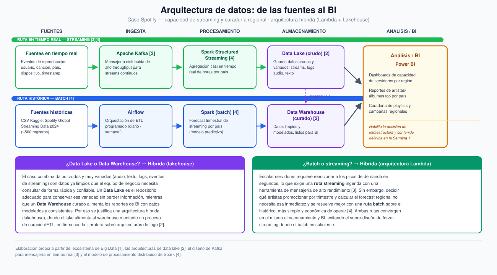

# Semana 3 — Diseña una arquitectura de datos

**Programa:** Ingeniería Industrial · **Asignatura:** Ciencia de Datos
**Unidad 1:** Fundamentos de Ciencia de Datos y Big Data · **Periodo:** 2026-B
**Modalidad:** Individual/parejas · **Tipo:** Formativa (sin nota)

> Continuación del caso **Spotify — capacidad de streaming y curaduría regional** (Semanas 1 y 2). Aquí se diseña la arquitectura completa: fuentes → ingesta → almacenamiento → procesamiento → análisis/BI, y se justifican las decisiones de lake/warehouse y batch/streaming [1].

---

## 1. Arquitectura del flujo completo

El caso combina dos rutas que convergen en el mismo almacenamiento y capa de BI: una **ruta en tiempo real (streaming)**, que alimenta la decisión de capacidad de servidores, y una **ruta histórica (batch)**, que alimenta el forecast trimestral y la curaduría de contenido.

```
RUTA STREAMING (tiempo real)
Eventos de reproducción ──▶ Apache Kafka ──▶ Spark Structured Streaming ──┐
(usuario, canción, país,      (ingesta)         (agregación casi          │
 dispositivo, timestamp)                         en tiempo real)          │
                                                                           ▼
                                                                     Data Lake (crudo)
                                                                           │
                                                                    curación / ETL
                                                                           ▼
Histórico CSV (Kaggle) ──▶ Airflow ──▶ Spark (batch) ──────────▶ Data Warehouse (curado)
(Spotify Global Streaming    (orquestación     (forecast trimestral            │
 Data 2024)                   de ETL)           por país)                     │
                                                                                ▼
                                                                    Análisis / BI (Power BI)
                                                          → dashboards de capacidad regional
                                                          → curaduría de playlists/campañas
```

El diagrama completo, con las dos rutas y sus etapas, está en **[`diagrama-arquitectura-datos.svg`](./diagrama-arquitectura-datos.svg)**:



---

## 2. ¿Data Lake o Data Warehouse?

**Decisión: arquitectura híbrida (lakehouse).**

El caso reúne datos crudos y muy variados —audio, texto de reseñas, logs de servidor, eventos de streaming— junto con datos que el negocio necesita consultar ya limpios y modelados para tomar decisiones rápidas. Un **data lake** es el repositorio adecuado para conservar esa variedad sin perder información ni forzar un esquema prematuro, mientras que un **data warehouse** curado es el que realmente sostiene los reportes de BI con datos consistentes y de bajo tiempo de respuesta [2]. Por eso se justifica una arquitectura híbrida: el lake recibe los datos crudos de ambas rutas y, mediante un proceso de curación/ETL, alimenta el warehouse que consume la capa de BI.

## 3. ¿Batch o streaming?

**Decisión: arquitectura híbrida (estilo Lambda).**

Escalar servidores y CDN exige reaccionar a los picos de demanda en cuestión de segundos, lo que requiere una ruta **streaming** ingerida con una herramienta de mensajería de alto rendimiento [3]. Sin embargo, decidir qué artistas promocionar por trimestre o calcular el forecast regional no necesita esa inmediatez: se resuelve mejor y de forma más económica con una ruta **batch** sobre el histórico [4]. Forzar streaming en toda la arquitectura sería sobre-ingeniería; forzar solo batch dejaría a infraestructura sin capacidad de reacción. Combinar ambas rutas —convergiendo en el mismo almacenamiento y BI— cubre los dos tipos de decisión definidos desde la Semana 1.

---

## 4. Herramienta candidata por etapa

| Etapa | Herramienta | Por qué |
|---|---|---|
| **Ingesta (streaming)** | **Apache Kafka** | Sistema de mensajería distribuida diseñado para manejar flujos continuos de eventos con alto throughput y baja latencia, ideal para millones de reproducciones por segundo [3] |
| **Ingesta (batch)** | **Airflow** | Orquesta y programa los procesos de ETL periódicos sobre el histórico, con dependencias y reintentos controlados |
| **Procesamiento** | **Apache Spark** (Structured Streaming + batch) | Motor de procesamiento distribuido en memoria que soporta tanto agregación casi en tiempo real como los cómputos de forecast por lotes, con la misma API [4] |
| **Análisis / BI** | **Power BI** | Permite construir dashboards interactivos de capacidad regional y reportes de artistas/álbumes top, consumidos directamente por los equipos de infraestructura y marketing |

---

## 5. Referencias (formato IEEE)

[1] Corporación Universitaria del Huila (CORHUILA), "Ciencia de Datos · Semana 3 · Ecosistema de Big Data," Objeto Virtual de Aprendizaje (OVA), Neiva, Colombia, 2026. [Online]. Disponible: https://code-corhuila.github.io/ova-web/2026-B/ciencia-datos/03-week/01-session/

[2] P. Sawadogo and J. Darmont, "On data lake architectures and metadata management," *Journal of Intelligent Information Systems*, vol. 56, no. 1, pp. 97–120, 2021.

[3] J. Kreps, N. Narkhede, and J. Rao, "Kafka: A distributed messaging system for log processing," in *Proc. 6th Int. Workshop on Networking Meets Databases (NetDB)*, Athens, Greece, 2011.

[4] M. Zaharia *et al.*, "Resilient distributed datasets: A fault-tolerant abstraction for in-memory cluster computing," in *Proc. 9th USENIX Symp. Networked Systems Design and Implementation (NSDI)*, San José, CA, USA, 2012, pp. 15–28.
