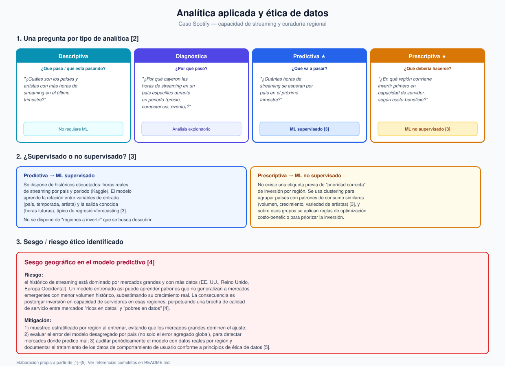

# Semana 4 — Tipos de analítica y ética

**Programa:** Ingeniería Industrial · **Asignatura:** Ciencia de Datos
**Unidad 1:** Fundamentos de Ciencia de Datos y Big Data · **Periodo:** 2026-B
**Modalidad:** Individual/parejas · **Tipo:** Formativa (sin nota)

> Continuación del caso **Spotify — capacidad de streaming y curaduría regional** (Semanas 1 a 3). Aquí se formula una pregunta por cada tipo de analítica, se justifica el enfoque de machine learning y se identifica un riesgo ético con su mitigación.

---

## 1. Una pregunta por tipo de analítica

| Tipo | Pregunta clave | Sobre el caso |
|---|---|---|
| **Descriptiva** | ¿Qué pasó / qué está pasando? | ¿Cuáles son los países y artistas con más horas de streaming en el último trimestre? |
| **Diagnóstica** | ¿Por qué pasó? | ¿Por qué cayeron las horas de streaming en un país específico durante un periodo determinado (cambio de precio, competencia, evento puntual)? |
| **Predictiva** | ¿Qué va a pasar? | ¿Cuántas horas de streaming se esperan por país en el próximo trimestre? |
| **Prescriptiva** | ¿Qué debería hacerse? | ¿En qué región conviene invertir primero en capacidad de servidor/CDN, según su relación costo-beneficio? |

Esta clasificación sigue la taxonomía estándar de analítica de negocio, que ordena las preguntas según su nivel de sofisticación y su cercanía a una acción concreta [2].

---

## 2. ¿Machine learning supervisado o no supervisado?

**Predictiva → ML supervisado.** Se dispone de un histórico *etiquetado*: las horas reales de streaming por país y periodo (dataset de Kaggle usado desde la Semana 1). El modelo aprende la relación entre variables de entrada (país, temporada, artista) y una salida ya conocida en el pasado (horas futuras), lo que corresponde a un problema clásico de regresión/forecasting supervisado [3].

**Prescriptiva → ML no supervisado.** No existe una etiqueta previa de "cuál es la región correcta para invertir primero": es justamente lo que se busca descubrir. Por eso se recurre a **clustering** para agrupar países con patrones de consumo similares (volumen, tasa de crecimiento, variedad de artistas) sin supervisión previa [3], y sobre esos grupos resultantes se aplican reglas de optimización costo-beneficio para priorizar la inversión en infraestructura.

---

## 3. Sesgo o riesgo ético identificado

### Sesgo geográfico en el modelo predictivo

**Riesgo:** el histórico de streaming está dominado por mercados grandes y con más datos disponibles (EE. UU., Reino Unido, Europa Occidental). Un modelo de machine learning aprende los patrones —y los sesgos— presentes en sus datos de entrenamiento [4]; si se entrena principalmente con esos mercados, puede generalizar mal a países emergentes con menor volumen histórico, subestimando su crecimiento real. La consecuencia práctica es postergar la inversión en capacidad de servidores en esas regiones, perpetuando una brecha de calidad de servicio entre mercados "ricos en datos" y "pobres en datos" [4].

**Cómo mitigarlo:**

1. **Muestreo estratificado por región** al entrenar el modelo, evitando que los mercados con más volumen dominen el ajuste de los parámetros.
2. **Evaluación desagregada del error** por país (no solo el error agregado global), para detectar específicamente en qué mercados el modelo predice peor [4].
3. **Auditoría periódica** del modelo contrastando sus predicciones contra datos reales por región, y documentación del tratamiento de los datos de comportamiento de usuario conforme a principios de ética de datos —transparencia, minimización y propósito legítimo del uso de la información— [5].

---

## 4. Diagrama

**[`diagrama-analitica-etica.svg`](./diagrama-analitica-etica.svg)** — las 4 preguntas de analítica aplicadas al caso, la justificación de ML supervisado/no supervisado, y el riesgo ético con su mitigación.

---

## 5. Referencias (formato IEEE)

[1] Corporación Universitaria del Huila (CORHUILA), "Ciencia de Datos · Semana 4 · Aplicaciones modernas de Big Data y ciencia de datos," Objeto Virtual de Aprendizaje (OVA), Neiva, Colombia, 2026. [Online]. Disponible: https://code-corhuila.github.io/ova-web/2026-B/ciencia-datos/04-week/01-session/

[2] T. H. Davenport and J. G. Harris, *Competing on Analytics: The New Science of Winning*. Boston, MA, USA: Harvard Business School Press, 2007.

[3] M. I. Jordan and T. M. Mitchell, "Machine learning: Trends, perspectives, and prospects," *Science*, vol. 349, no. 6245, pp. 255–260, 2015.

[4] N. Mehrabi, F. Morstatter, N. Saxena, K. Lerman, and A. Galstyan, "A survey on bias and fairness in machine learning," *ACM Computing Surveys*, vol. 54, no. 6, pp. 1–35, 2021.

[5] L. Floridi and M. Taddeo, "What is data ethics?," *Philosophical Transactions of the Royal Society A*, vol. 374, no. 2083, art. 20160360, 2016.
