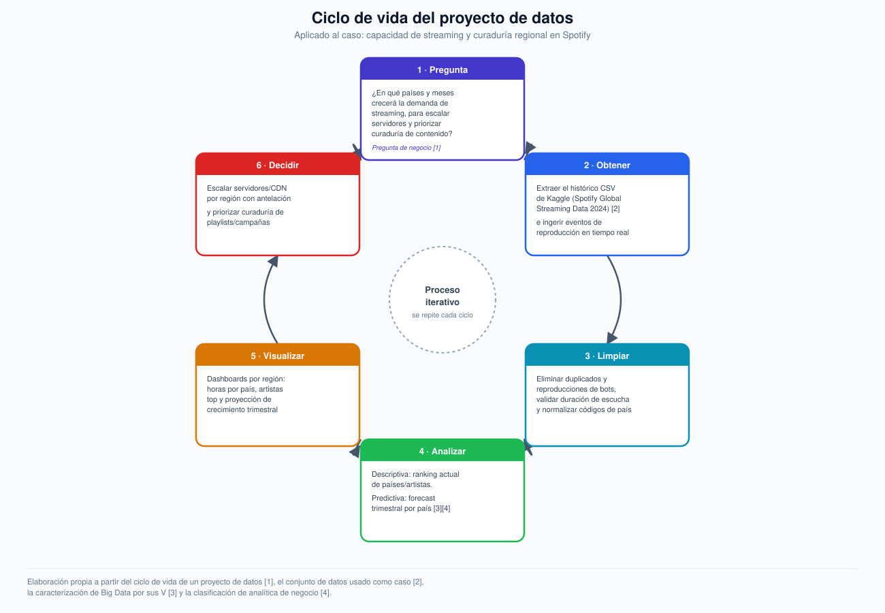

# Actividad calificable · Corte 1 — Diagnóstico de datos de un proceso

**Programa:** Ingeniería Industrial · **Asignatura:** Ciencia de Datos
**Semana del corte:** 4 · Drewroots

> Caso desarrollado: **Spotify — capacidad de streaming y curaduría regional**, el mismo proceso de negocio trabajado en las actividades formativas de las Semanas 1 a 4. Este documento consolida y profundiza ese caso para responder íntegramente al enunciado de la actividad calificable.

---

## 1. Problema y pregunta de datos

**Problema real (servicio de streaming):** Spotify necesita anticipar los picos regionales de demanda de streaming para que el equipo de infraestructura escale la capacidad de servidores y CDN a tiempo, y para que el equipo de contenido decida qué artistas y álbumes promocionar en cada mercado.

> **Pregunta de datos:** ¿En qué países y en qué momentos del año aumentará la demanda de streaming en Spotify, de modo que se pueda escalar la capacidad de infraestructura con antelación y priorizar la curaduría de contenido por región?

La pregunta es clara y accionable: define una unidad de análisis (país × periodo), una métrica observable (horas de streaming) y dos decisiones de negocio concretas que se derivan directamente de la respuesta [1].

---

## 2. Inventario de datos (mínimo 6 fuentes/campos)

| # | Fuente / campo | Descripción | Tipo |
|---|---|---|---|
| 1 | **Histórico de streaming (CSV)** | *Spotify Global Streaming Data (2024)*, Kaggle: horas por país, artistas/álbumes top, comportamiento del oyente [2] | **Estructurado** |
| 2 | **Encuestas de satisfacción** | Formularios cerrados a usuarios (escala Likert, opción múltiple), campos fijos y tabulables | **Estructurado** |
| 3 | **Eventos de reproducción en tiempo real** | Registros JSON por cada stream: `user_id`, `track_id`, país, dispositivo, `timestamp` | **Semiestructurado** |
| 4 | **Metadatos de catálogo musical** | Artista, álbum, género y duración obtenidos vía API (JSON/XML) | **Semiestructurado** |
| 5 | **Logs de servidores/CDN por región** | Registros de tráfico, latencia y errores; formato de log con campos variables | **Semiestructurado** |
| 6 | **Reseñas y comentarios de usuarios** | Texto libre en redes sociales sobre artistas/álbumes, sin esquema predefinido | **No estructurado** |
| 7 | **Archivos de audio** | Pistas de las canciones, usadas para análisis de contenido y etiquetado automático de género | **No estructurado** |

Un dato es **estructurado** cuando se ajusta a un esquema tabular fijo, **semiestructurado** cuando tiene organización interna sin esquema rígido (JSON, logs), y **no estructurado** cuando carece de formato predefinido, como texto libre o audio [1].

---

## 3. Tipo de analítica aplicada y justificación de Big Data

### Tipo de analítica

| Tipo | Pregunta que responde | Aplicación en el caso |
|---|---|---|
| **Descriptiva** | ¿Qué está pasando? | ¿Qué países y artistas dominan hoy el streaming global? |
| **Predictiva** *(foco principal)* | ¿Qué va a pasar? | ¿Cuánto crecerá el streaming el próximo trimestre, por país? |
| **Prescriptiva** *(extensión opcional)* | ¿Qué debería hacerse? | ¿En qué región conviene invertir primero en más capacidad de servidor? |

Se avanza de lo descriptivo (necesario para entender el estado actual) hacia lo predictivo (necesario para anticipar la demanda), siguiendo la taxonomía estándar de analítica de negocio, en la que cada nivel aporta mayor valor de decisión que el anterior [4].

### ¿Es un caso de Big Data?

**Sí.** El caso cumple con las propiedades que caracterizan al Big Data [3]:

| V | Evidencia en el caso |
|---|---|
| **Volumen** | Millones de reproducciones agregadas globalmente y de forma continua por región |
| **Velocidad** | Los eventos de streaming se generan en tiempo real, segundo a segundo |
| **Variedad** | Coexisten datos estructurados (CSV, encuestas), semiestructurados (logs, JSON) y no estructurados (audio, texto) |
| **Veracidad** | Riesgo de reproducciones infladas por bots o duplicados que distorsionan la demanda real por país |
| **Valor** | Solo genera valor si se traduce en la decisión de capacidad de infraestructura y curaduría de contenido |

---

## 4. Ciclo de vida del proyecto aplicado al caso

**[`diagrama-ciclo-vida.svg`](./diagrama-ciclo-vida.svg)** — pregunta → obtener → limpiar → analizar → visualizar → decidir, como proceso iterativo que se repite en cada ciclo de planeación.

| Etapa | Aplicación en el caso |
|---|---|
| **1. Pregunta** | ¿En qué países/meses crecerá la demanda, para escalar servidores y priorizar contenido? |
| **2. Obtener** | Extraer el histórico CSV de Kaggle [2] e ingerir los eventos de reproducción en tiempo real |
| **3. Limpiar** | Eliminar duplicados y reproducciones de bots, validar duración de escucha, normalizar códigos de país |
| **4. Analizar** | Analítica descriptiva (ranking actual) y predictiva (forecast trimestral por país) [3][4] |
| **5. Visualizar** | Dashboards por región: horas por país, artistas top y proyección de crecimiento |
| **6. Decidir** | Escalar servidores/CDN por región y priorizar curaduría de playlists y campañas |

El resultado de "Decidir" retroalimenta la siguiente iteración del ciclo, ya que la infraestructura escalada y las campañas lanzadas generan nuevos datos que vuelven a alimentar la pregunta de negocio [1].

---

## 5. Problem & data (English)

Spotify needs to anticipate regional spikes in streaming demand so that the infrastructure team can scale server and CDN capacity ahead of time, and the content team can decide which artists and albums to promote in each market. The core data question is: in which countries and at which times of the year will streaming hours grow the most over the next quarter? To answer this, the project uses the *Spotify Global Streaming Data (2024)* dataset from Kaggle [2], which reports listening hours, top countries, top artists and albums, and user behavior patterns; this historical, structured data is complemented with near-real-time playback events (user, track, country, device, timestamp) that capture the speed and variety typical of a Big Data problem [3]. Given that a labeled historical target — actual streaming hours per country and period — is available, the main analytics type applied is **predictive analytics**, built on top of a **descriptive** baseline that first summarizes the countries and artists currently leading the market [4]. Data quality is a real concern, since bot plays or duplicated events could distort the demand attributed to a given country, so a cleaning step is included before any modeling takes place. Ultimately, the value of this pipeline depends entirely on whether its output is translated into the two business decisions it was designed for: infrastructure capacity planning and regional content curation.

---

## 6. Referencias (formato IEEE)

[1] Corporación Universitaria del Huila (CORHUILA), "Ciencia de Datos · Semana 1 · Introducción a la ciencia de datos," Objeto Virtual de Aprendizaje (OVA), Neiva, Colombia, 2026. [Online]. Disponible: https://code-corhuila.github.io/ova-web/2026-B/ciencia-datos/01-week/01-session/

[2] A. Soundankar, "Spotify Global Streaming Data (2024)," Kaggle, 2024. [Online]. Disponible: https://www.kaggle.com/datasets/atharvasoundankar/spotify-global-streaming-data-2024

[3] Ishwarappa and J. Anuradha, "A brief introduction on big data 5Vs characteristics and Hadoop technology," *Procedia Computer Science*, vol. 48, pp. 319–324, 2015.

[4] T. H. Davenport and J. G. Harris, *Competing on Analytics: The New Science of Winning*. Boston, MA, USA: Harvard Business School Press, 2007.
