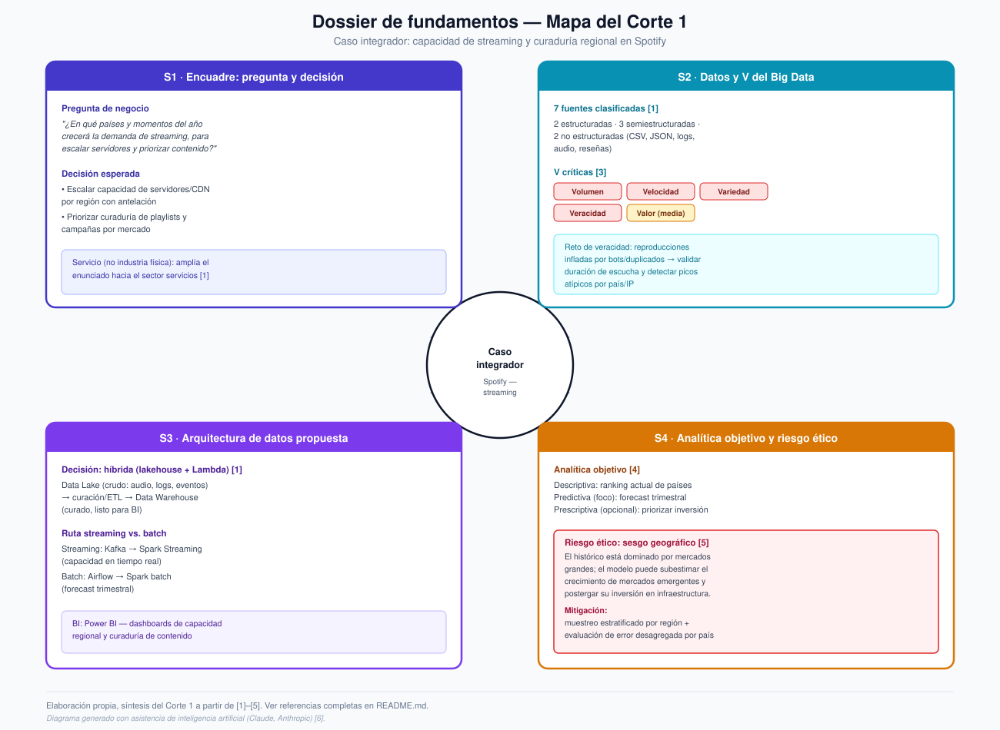

# Semana 5 — Dossier de fundamentos (cierre Corte 1)

**Programa:** Ingeniería Industrial · **Asignatura:** Ciencia de Datos
**Unidad 1:** Fundamentos de Ciencia de Datos y Big Data · **Periodo:** 2026-B
**Modalidad:** Individual/parejas · **Tipo:** Formativa (sin nota)

> Este dossier integra y mejora, en un solo documento, el trabajo desarrollado durante el Corte 1 sobre el caso **Spotify — capacidad de streaming y curaduría regional**: encuadre del proyecto (S1), datos y Big Data (S2), arquitectura (S3) y analítica con ética (S4) [1].

*Fig. 1. Diagrama generado con asistencia de inteligencia artificial (Claude, Anthropic) [6], a partir del contenido y las fuentes desarrolladas en este dossier.*

---

## 1. Encuadre del proyecto: pregunta de negocio y decisión esperada (S1)

Spotify, como servicio digital de streaming, necesita anticipar los picos regionales de demanda para que el equipo de infraestructura escale servidores y CDN a tiempo, y para que el equipo de contenido decida qué artistas y álbumes promocionar en cada mercado. Tratarlo como un caso de **servicios** —y no de industria física— amplía el enunciado original del corte y permite ilustrar con un solo ejemplo las propiedades del Big Data en un contexto no manufacturero [1].

> **Pregunta de negocio:** ¿En qué países y en qué momentos del año aumentará la demanda de streaming en Spotify, de modo que se pueda escalar la capacidad de infraestructura con antelación y priorizar la curaduría de contenido por región?

**Decisión esperada:**

- **Infraestructura:** escalar la capacidad de servidores y CDN por región con antelación al pico de demanda.
- **Contenido:** priorizar qué artistas, álbumes o playlists destacar en cada mercado (curaduría y publicidad segmentada).

La pregunta es clara y accionable porque define una unidad de análisis (país × periodo), una métrica observable (horas de streaming) y dos decisiones medibles que se derivan directamente de su respuesta.

---

## 2. Fuentes y clasificación de datos + V relevantes (S2)

El caso reúne **siete fuentes de datos**, clasificadas por su nivel de estructura:

| Fuente | Tipo |
|---|---|
| Histórico de streaming (CSV, Kaggle) [2] | Estructurado |
| Encuestas de satisfacción al usuario | Estructurado |
| Eventos de reproducción en tiempo real (JSON) | Semiestructurado |
| Metadatos de catálogo musical (API) | Semiestructurado |
| Logs de servidores/CDN por región | Semiestructurado |
| Reseñas y comentarios de usuarios | No estructurado |
| Archivos de audio de las canciones | No estructurado |

**V del Big Data críticas para el caso** [3]:

| V | Criticidad | Por qué |
|---|---|---|
| Volumen | Crítica | Millones de reproducciones agregadas globalmente y de forma continua |
| Velocidad | Crítica | Los eventos de streaming llegan en tiempo real, segundo a segundo |
| Variedad | Crítica | Coexisten datos estructurados, semiestructurados y no estructurados |
| Veracidad | Crítica | Riesgo de reproducciones infladas por bots o duplicados |
| Valor | Media | Solo genera valor si se traduce en las decisiones de infraestructura y contenido |

El reto de calidad más relevante es la **veracidad**: se mitiga validando que la duración de escucha registrada no exceda la del track y detectando picos atípicos de reproducciones por país o IP en ventanas de tiempo cortas.

---

## 3. Arquitectura de datos propuesta (S3)

**Decisión: arquitectura híbrida (lakehouse + Lambda)** [1].

El flujo va de las fuentes a la ingesta, el almacenamiento, el procesamiento y el análisis/BI, combinando dos rutas que convergen en el mismo repositorio:

- **Ruta streaming:** eventos de reproducción → **Apache Kafka** (ingesta de alto throughput) → **Spark Structured Streaming** (agregación casi en tiempo real) → Data Lake.
- **Ruta batch:** histórico CSV [2] → **Airflow** (orquestación de ETL) → **Spark batch** (forecast trimestral) → Data Warehouse curado.

Un **Data Lake** conserva la variedad de datos crudos (audio, texto, logs, eventos) sin perder información, mientras que un **Data Warehouse** curado alimenta los reportes de BI con datos limpios y consistentes; por eso se opta por una arquitectura híbrida en la que el lake alimenta al warehouse mediante curación/ETL [1]. De igual forma, la capacidad de infraestructura exige reacción en segundos (streaming), mientras que el forecast trimestral y la curaduría de contenido se resuelven mejor con procesamiento por lotes (batch), lo que justifica una arquitectura tipo Lambda que combina ambas rutas. La capa de **BI (Power BI)** cierra el flujo con dashboards de capacidad regional y reportes de artistas/álbumes top.

---

## 4. Tipos de analítica objetivo y un riesgo ético (S4)

**Analítica objetivo** [4]:

| Tipo | Pregunta aplicada al caso |
|---|---|
| Descriptiva | ¿Qué países y artistas dominan hoy el streaming global? |
| **Predictiva (foco principal)** | ¿Cuánto crecerá el streaming el próximo trimestre, por país? |
| Prescriptiva (extensión opcional) | ¿En qué región conviene invertir primero en más capacidad de servidor? |

La predictiva usa **ML supervisado**, porque se dispone de un histórico etiquetado (horas reales por país y periodo); la prescriptiva, de explorarse, usaría **ML no supervisado** (clustering de países por patrón de consumo), ya que no existe una etiqueta previa de "dónde invertir primero".

**Riesgo ético identificado — sesgo geográfico:** el histórico de streaming está dominado por mercados grandes y con más datos (EE. UU., Reino Unido, Europa Occidental). Un modelo entrenado principalmente con esos mercados puede generalizar mal a países emergentes con menor volumen histórico, subestimando su crecimiento real y postergando la inversión en infraestructura allí, lo que perpetuaría una brecha de calidad de servicio entre regiones "ricas en datos" y "pobres en datos" [5].

**Mitigación:** muestreo estratificado por región al entrenar el modelo, evaluación del error desagregada por país (no solo el error global) y auditoría periódica de las predicciones contra datos reales por mercado [5].

---

## 5. Diagrama

**[`diagrama-dossier-corte1.svg`](./diagrama-dossier-corte1.svg)** — mapa visual de las cuatro partes del corte (encuadre, datos/V's, arquitectura, analítica/ética) alrededor del caso integrador. Diagrama generado con asistencia de inteligencia artificial [6].

---

## 6. Referencias (formato IEEE)

[1] Corporación Universitaria del Huila (CORHUILA), "Ciencia de Datos · Semana 5 · Repaso y evaluación del Corte 1," Objeto Virtual de Aprendizaje (OVA), Neiva, Colombia, 2026. [Online]. Disponible: https://code-corhuila.github.io/ova-web/2026-B/ciencia-datos/05-week/01-session/

[2] A. Soundankar, "Spotify Global Streaming Data (2024)," Kaggle, 2024. [Online]. Disponible: https://www.kaggle.com/datasets/atharvasoundankar/spotify-global-streaming-data-2024

[3] Ishwarappa and J. Anuradha, "A brief introduction on big data 5Vs characteristics and Hadoop technology," *Procedia Computer Science*, vol. 48, pp. 319–324, 2015.

[4] T. H. Davenport and J. G. Harris, *Competing on Analytics: The New Science of Winning*. Boston, MA, USA: Harvard Business School Press, 2007.

[5] N. Mehrabi, F. Morstatter, N. Saxena, K. Lerman, and A. Galstyan, "A survey on bias and fairness in machine learning," *ACM Computing Surveys*, vol. 54, no. 6, pp. 1–35, 2021.

[6] Anthropic, "Claude" (modelo de lenguaje asistido por IA), 2026. Usado para generar el diagrama `diagrama-dossier-corte1.svg` a partir del contenido de este documento. [Online]. Disponible: https://www.anthropic.com/claude
