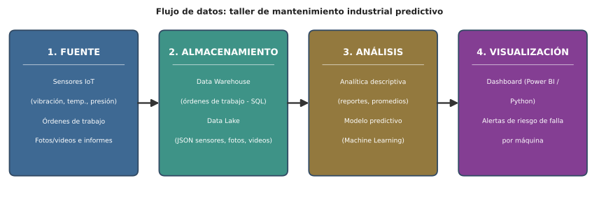

# Parcial práctico – Corte 1: Ciencia de Datos aplicada a un caso empresarial

**Estudiante:** Julian Andres Solano Ledesma
**Programa:** Ingeniería Mecatrónica – VI semestre
**Institución:** Corporación Universitaria del Huila - CORHUILA
**Asignatura:** Ciencia de Datos (Electiva)
**Actividad:** Parcial práctico – Corte 1 
**Modalidad:** Individual
**Fecha de entrega:** 8 de septiembre de 2026

---

## Caso seleccionado

Para este ejercicio se eligió un caso sencillo, cercano al perfil de Ingeniería Mecatrónica: un pequeño taller de mantenimiento industrial llamado **"MecaServicios"**, que presta servicio de mantenimiento a maquinaria (tornos, compresores y motores eléctricos) a varias fábricas de la región.

Actualmente el taller trabaja de forma reactiva (arregla la máquina cuando ya falló) y preventiva (revisiones programadas cada cierto tiempo). El objetivo del ejercicio es mostrar, con un caso concreto, cómo el taller podría avanzar hacia el **mantenimiento predictivo**: usar los datos que ya genera —y algunos datos nuevos, como sensores— para anticipar cuándo una máquina va a fallar, antes de que se detenga la producción del cliente.

Este caso se apoya directamente en lo visto en el curso: el material de la Semana 4 presenta el "mantenimiento predictivo" como una de las aplicaciones más comunes de Big Data en la industria, y la Semana 2 explica que los sensores de una línea de producción permiten anticipar fallas, optimizar procesos y reducir costos cuando se aprovechan correctamente (CORHUILA, 2026). La idea también coincide con fuentes externas sobre mantenimiento predictivo con sensores IoT en la industria manufacturera (Advanced Factories, 2024).

---

## 1. Identificación y clasificación de 4 tipos de datos

En el taller "MecaServicios" conviven datos muy distintos entre sí. La siguiente tabla identifica cuatro de ellos y los clasifica según lo visto en la Semana 2 del curso, que distingue los datos **estructurados** (tablas con filas y columnas), **semiestructurados** (estructura flexible, con etiquetas, como JSON o XML) y **no estructurados** (sin formato fijo, como imágenes, audio, video o texto libre).

| # | Tipo de dato | Descripción en el taller | Clasificación |
|---|---|---|---|
| 1 | Órdenes de trabajo y mantenimientos | Tabla en una base de datos con: máquina, fecha, técnico, tipo de falla, horas y costo de la reparación. | **Estructurado** |
| 2 | Lecturas de sensores IoT | Archivos en formato JSON enviados por sensores de vibración, temperatura y presión instalados en las máquinas. | **Semiestructurado** |
| 3 | Fotos y videos de inspección | Imágenes y videos que el técnico toma de piezas desgastadas o de la máquina en funcionamiento. | **No estructurado** |
| 4 | Correos y reportes de los clientes | Mensajes en texto libre donde el cliente describe la falla percibida (p. ej. "la máquina suena raro", "se calienta mucho"). | **No estructurado** |

### ¿Por qué se clasifican así?

- **Órdenes de trabajo (estructurado):** encajan perfectamente en filas y columnas, igual que una hoja de cálculo o una tabla SQL; cada campo tiene un tipo de dato fijo (fecha, texto, número).
- **Lecturas de sensores IoT (semiestructurado):** no están organizadas en una tabla rígida, pero cada registro sí trae etiquetas identificables (marca de tiempo, id de la máquina, valor de la lectura), típicas de archivos JSON o XML.
- **Fotos y videos (no estructurado):** no tienen columnas ni etiquetas; es contenido "libre" que solo se puede interpretar con técnicas especiales (visión por computador), no con una simple consulta a una tabla.
- **Correos y reportes de clientes (no estructurado):** es lenguaje natural escrito por personas, sin una estructura predefinida, por lo que se procesa de forma distinta a un dato numérico o tabular.

---

## 2. Preguntas de analítica

El material de la Semana 4 presenta cuatro niveles de analítica según la pregunta que responden: descriptiva (¿qué pasó?), diagnóstica (¿por qué pasó?), predictiva (¿qué va a pasar?) y prescriptiva (¿qué debo hacer?). Para el caso de MecaServicios se plantean una pregunta descriptiva y una predictiva:

**Pregunta de analítica descriptiva**

> ¿Cuántas fallas tuvo cada máquina y cuál fue el costo total de mantenimiento durante el último trimestre?

Es descriptiva porque solo resume datos históricos que ya existen (las órdenes de trabajo pasadas) para entender qué ha ocurrido hasta ahora, sin intentar anticipar nada hacia el futuro.

**Pregunta de analítica predictiva**

> Según las lecturas de vibración y temperatura de los sensores, ¿qué máquinas tienen mayor probabilidad de fallar en los próximos 30 días?

Es predictiva porque combina datos históricos con datos en tiempo real (sensores) para estimar un evento que todavía no ha pasado, usando patrones que un modelo de machine learning aprende de fallas anteriores.

---

## 3. Diagrama del flujo de datos

El siguiente diagrama resume, para el caso de MecaServicios, el recorrido que sigue el dato desde que se genera hasta que se convierte en información útil para tomar decisiones:

**Fuente → Almacenamiento → Análisis → Visualización**

### Explicación sencilla de cada etapa

- **Fuente:** los sensores IoT instalados en las máquinas, la base de datos de órdenes de trabajo, y las fotos, videos e informes que generan los técnicos y los clientes.
- **Almacenamiento:** los datos estructurados (órdenes de trabajo) se guardan en un *data warehouse*; los datos semiestructurados y no estructurados (sensores, fotos, videos) se guardan en un *data lake*, que admite cualquier tipo de archivo.
- **Análisis:** se aplica analítica descriptiva para generar reportes históricos (costos, número de fallas) y un modelo predictivo (machine learning) entrenado con los datos de sensores para anticipar fallas futuras.
- **Visualización:** los resultados se muestran en un tablero (*dashboard*) con gráficos de costos y *downtime*, y con alertas cuando una máquina tiene alto riesgo de fallar pronto.

---

## 4. Descriptive analytics vs. predictive analytics (English)

Below are two sentences, in English, explaining the difference between descriptive and predictive analytics for the MecaServicios case:

1. *Descriptive analytics looks at historical maintenance records to explain what has already happened, such as how many failures occurred and how much they cost.*

  

2. *Predictive analytics uses sensor data and machine learning models to forecast which machines are likely to fail soon, so that maintenance can be scheduled before a breakdown happens.*

  

---

## Bibliografía

### Fuentes del curso 

- CORHUILA. (2026). *Ciencia de Datos – Semana 1: Introducción a la ciencia de datos.* https://code-corhuila.github.io/ova-web/2026-B/ciencia-datos/01-week/01-session/
- CORHUILA. (2026). *Ciencia de Datos – Semana 2: Fundamentos de Big Data.* https://code-corhuila.github.io/ova-web/2026-B/ciencia-datos/02-week/01-session/
- CORHUILA. (2026). *Ciencia de Datos – Semana 3: Ecosistema de Big Data.* https://code-corhuila.github.io/ova-web/2026-B/ciencia-datos/03-week/01-session/
- CORHUILA. (2026). *Ciencia de Datos – Semana 4: Aplicaciones modernas de Big Data y ciencia de datos.* https://code-corhuila.github.io/ova-web/2026-B/ciencia-datos/04-week/01-session/
- CORHUILA. (2026). *Ciencia de Datos – Semana 5: Repaso y evaluación del Corte 1.* https://code-corhuila.github.io/ova-web/2026-B/ciencia-datos/05-week/01-session/

### Referencias adicionales 

- Advanced Factories. (2024). *Mantenimiento predictivo en la industria manufacturera con Big Data e IIoT.* https://www.advancedfactories.com/mantenimiento-predictivo-industria-manufacturera-big-data-iiot/
- IBM. (s.f.). *Structured vs. unstructured data.* https://www.ibm.com/think/topics/structured-vs-unstructured-data
- UNSW Online. (s.f.). *Descriptive, predictive and prescriptive analytics: What are the differences?* https://studyonline.unsw.edu.au/blog/descriptive-predictive-prescriptive-analytics
