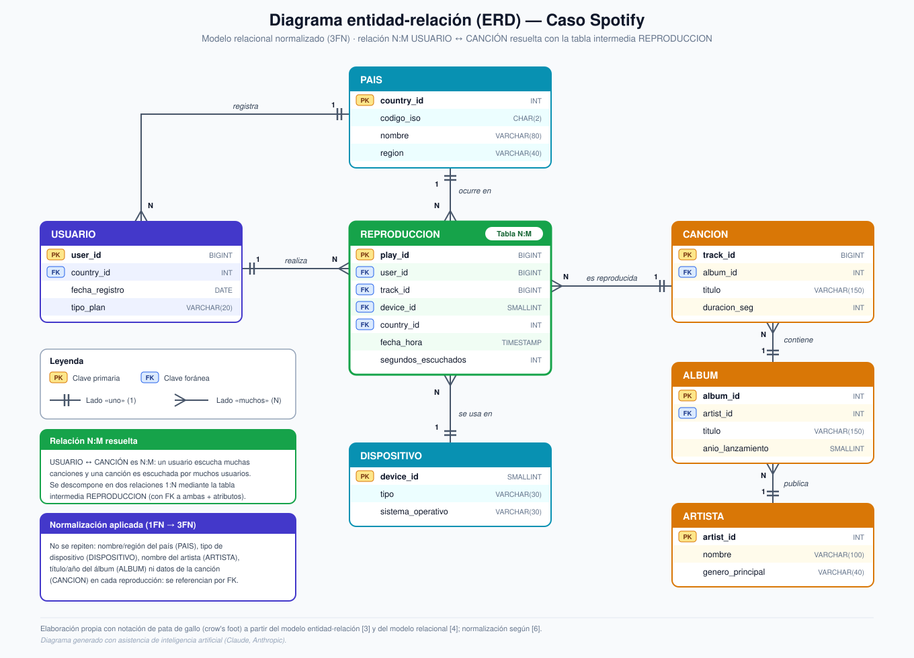

# Semana 6 — ERD de tu caso

**Programa:** Ingeniería Industrial · **Asignatura:** Ciencia de Datos
**Unidad 2:** Modelamiento, transformación y conexión de datos · **Corte 2 · Semana 6** · **Periodo:** 2026-B
**Modalidad:** Individual/parejas · **Tipo:** Formativa (sin nota)

**Julián Andrés Solano Ledesma**

> Continuación del caso **Spotify — capacidad de streaming y curaduría regional** del Corte 1. Aquí se traduce el inventario de datos y la pregunta de negocio en un **modelo entidad-relación (ERD)** con claves PK/FK, una relación N:M resuelta con tabla intermedia, una decisión relacional/NoSQL justificada y la normalización aplicada.

---

## 1. Punto de partida: qué debe poder responder el modelo

Un error frecuente al modelar es diseñar tablas sin conocer las preguntas de negocio que deben contestar [1]. Por eso el ERD se deriva directamente de la pregunta del Corte 1: *¿en qué países y momentos del año aumentará la demanda de streaming, para escalar infraestructura y priorizar contenido por región?* Esa pregunta exige que el modelo permita, como mínimo:

- sumar **horas de escucha por país y periodo** (decisión de capacidad de servidores/CDN);
- identificar **artistas y álbumes más escuchados por país** (decisión de curaduría);
- distinguir el **dispositivo** desde el que se reproduce (variedad de datos identificada en la Semana 2).

El modelo es un **diseño objetivo** para el caso; el conjunto de datos de Kaggle [2] reporta horas escuchadas, países y artistas/álbumes top (información agregada), por lo que se usaría para calibrar y validar el modelo, mientras que los eventos de reproducción individuales (JSON, tiempo real) poblarían la tabla de hechos.

---

## 2. Diagrama entidad-relación (ERD)



*Fig. 1. ERD del caso Spotify en notación de pata de gallo. Diagrama generado con asistencia de inteligencia artificial (Claude, Anthropic), a partir del modelo diseñado en este documento.*

Un ERD representa las **entidades** (los "objetos" del dominio), sus **atributos** y las **relaciones** entre ellas [3]; en el modelo relacional cada entidad se vuelve una tabla identificada por una **clave primaria (PK)** y vinculada a otras mediante **claves foráneas (FK)** [4].

### 2.1 Entidades y atributos

| Entidad | PK | FK (clave foránea) | Atributos | Rol en el modelo |
|---|---|---|---|---|
| **PAIS** | `country_id` | Ninguna (catálogo independiente) | `codigo_iso`, `nombre`, `region` | Catálogo geográfico; unidad de análisis de la demanda |
| **USUARIO** | `user_id` | `country_id` → PAIS | `fecha_registro`, `tipo_plan` | Oyente (identificador seudonimizado) |
| **DISPOSITIVO** | `device_id` | Ninguna (catálogo independiente) | `tipo`, `sistema_operativo` | Catálogo de dispositivos de reproducción |
| **ARTISTA** | `artist_id` | Ninguna (catálogo independiente) | `nombre`, `genero_principal` | Catálogo musical |
| **ALBUM** | `album_id` | `artist_id` → ARTISTA | `titulo`, `anio_lanzamiento` | Catálogo musical |
| **CANCION** | `track_id` | `album_id` → ALBUM | `titulo`, `duracion_seg` | Catálogo musical |
| **REPRODUCCION** | `play_id` | `user_id`, `track_id`, `device_id`, `country_id` | `fecha_hora`, `segundos_escuchados` | **Tabla de hechos e intermedia N:M**: un evento de escucha |

> **¿Por qué hay entidades sin FK?** Una FK existe solo cuando la tabla *depende* de otra. `PAIS`, `DISPOSITIVO` y `ARTISTA` son catálogos raíz: no necesitan referenciar a nadie, y son las demás tablas las que las referencian. Por eso su columna FK dice "Ninguna" y no se deja en blanco [4].

### 2.2 Relaciones y cardinalidades

Las relaciones pueden ser 1:1, 1:N o N:M; esta última no se implementa directamente sino con una tabla intermedia [1].

| Relación | Cardinalidad | Lectura |
|---|---|---|
| PAIS — USUARIO | 1:N | Un país registra muchos usuarios; cada usuario tiene un país de registro |
| PAIS — REPRODUCCION | 1:N | Una reproducción ocurre en un país (donde se consume el servicio) |
| USUARIO — REPRODUCCION | 1:N | Un usuario realiza muchas reproducciones |
| DISPOSITIVO — REPRODUCCION | 1:N | Un dispositivo (tipo/SO) se usa en muchas reproducciones |
| CANCION — REPRODUCCION | 1:N | Una canción es reproducida muchas veces |
| ARTISTA — ALBUM | 1:N | Un artista publica muchos álbumes |
| ALBUM — CANCION | 1:N | Un álbum contiene muchas canciones |
| **USUARIO — CANCION** | **N:M** | Resuelta con la tabla intermedia **REPRODUCCION** |

> **Decisión de diseño:** `REPRODUCCION` lleva su propio `country_id`. El país de *registro* del usuario no siempre coincide con el país desde donde *reproduce*, y la capacidad de servidores depende de dónde ocurre el consumo, no de dónde se registró la cuenta.

### 2.3 La relación N:M y su tabla intermedia

Un usuario escucha muchas canciones y una canción es escuchada por muchos usuarios: **USUARIO ↔ CANCION es N:M**. Se descompone en dos relaciones 1:N (USUARIO—REPRODUCCION y CANCION—REPRODUCCION) mediante `REPRODUCCION`, que contiene las FK hacia ambas entidades y además **atributos propios de la relación** (`fecha_hora`, `segundos_escuchados`) que no pertenecen ni al usuario ni a la canción. Se eligió una PK sustituta (`play_id`) porque el mismo usuario puede escuchar la misma canción varias veces, incluso en el mismo minuto, y la combinación (usuario, canción) no identifica un evento de forma única.

### 2.4 Esquema SQL del modelo

```sql
CREATE TABLE pais (
  country_id  INT PRIMARY KEY,
  codigo_iso  CHAR(2)     NOT NULL UNIQUE,
  nombre      VARCHAR(80) NOT NULL,
  region      VARCHAR(40) NOT NULL
);

CREATE TABLE dispositivo (
  device_id          SMALLINT PRIMARY KEY,
  tipo               VARCHAR(30) NOT NULL,
  sistema_operativo  VARCHAR(30) NOT NULL,
  UNIQUE (tipo, sistema_operativo)
);

CREATE TABLE usuario (
  user_id         BIGINT PRIMARY KEY,
  country_id      INT         NOT NULL REFERENCES pais (country_id),
  fecha_registro  DATE        NOT NULL,
  tipo_plan       VARCHAR(20) NOT NULL
);

CREATE TABLE artista (
  artist_id         INT PRIMARY KEY,
  nombre            VARCHAR(100) NOT NULL,
  genero_principal  VARCHAR(40)
);

CREATE TABLE album (
  album_id          INT PRIMARY KEY,
  artist_id         INT          NOT NULL REFERENCES artista (artist_id),
  titulo            VARCHAR(150) NOT NULL,
  anio_lanzamiento  SMALLINT
);

CREATE TABLE cancion (
  track_id      BIGINT PRIMARY KEY,
  album_id      INT          NOT NULL REFERENCES album (album_id),
  titulo        VARCHAR(150) NOT NULL,
  duracion_seg  INT          NOT NULL CHECK (duracion_seg > 0)
);

-- Tabla intermedia de la relación N:M USUARIO <-> CANCION
CREATE TABLE reproduccion (
  play_id              BIGINT PRIMARY KEY,
  user_id              BIGINT    NOT NULL REFERENCES usuario (user_id),
  track_id             BIGINT    NOT NULL REFERENCES cancion (track_id),
  device_id            SMALLINT  NOT NULL REFERENCES dispositivo (device_id),
  country_id           INT       NOT NULL REFERENCES pais (country_id),
  fecha_hora           TIMESTAMP NOT NULL,
  segundos_escuchados  INT       NOT NULL CHECK (segundos_escuchados >= 0)
);

CREATE INDEX idx_reproduccion_pais_fecha ON reproduccion (country_id, fecha_hora);
```

El esquema se verificó cargándolo en una base SQLite con claves foráneas activas: las restricciones `FOREIGN KEY` y `CHECK` rechazan, respectivamente, una reproducción que apunta a una canción inexistente y una con segundos negativos. La regla "`segundos_escuchados` no puede superar `duracion_seg`" involucra dos tablas, por lo que se valida en la etapa de limpieza del ciclo de vida (reto de **veracidad** de la Semana 2), no con un `CHECK`.

**Consultas que el modelo habilita** (horas por país y mes, y artistas más escuchados por país):

```sql
-- Demanda por país y mes -> decisión de capacidad (PostgreSQL)
SELECT p.nombre AS pais,
       date_trunc('month', r.fecha_hora)        AS mes,
       ROUND(SUM(r.segundos_escuchados) / 3600.0, 1) AS horas
FROM reproduccion r
JOIN pais p ON p.country_id = r.country_id
GROUP BY p.nombre, date_trunc('month', r.fecha_hora)
ORDER BY mes, horas DESC;

-- Artistas top por país -> decisión de curaduría
SELECT p.nombre AS pais, a.nombre AS artista,
       ROUND(SUM(r.segundos_escuchados) / 3600.0, 1) AS horas
FROM reproduccion r
JOIN pais    p  ON p.country_id = r.country_id
JOIN cancion c  ON c.track_id   = r.track_id
JOIN album   al ON al.album_id  = c.album_id
JOIN artista a  ON a.artist_id  = al.artist_id
GROUP BY p.nombre, a.nombre
ORDER BY p.nombre, horas DESC;
```

---

## 3. ¿Relacional o NoSQL?

**Decisión: enfoque relacional para el núcleo curado del caso, y almacenamiento NoSQL únicamente para los eventos crudos de reproducción en la ingesta** (persistencia políglota, coherente con la arquitectura *lakehouse* de la Semana 3).

Las bases relacionales organizan los datos en tablas con esquema fijo, mientras que las NoSQL usan documentos o pares clave-valor con estructura flexible; las primeras encajan con datos estructurados y las segundas con datos de forma variable [1]. La literatura comparativa señala que los sistemas relacionales destacan cuando se requiere alta exactitud y consistencia mediante las propiedades ACID, mientras que los NoSQL ofrecen flexibilidad de esquema y escalado horizontal para grandes volúmenes de datos de tipos diversos [5]. Contrastado con el caso:

| Criterio | Relacional (SQL) | NoSQL | Decisión para el caso |
|---|---|---|---|
| **Esquema** | Fijo y declarado | Flexible, admite datos de forma variable [5] | Catálogo, usuarios y hechos tienen esquema estable → **relacional**; el JSON crudo del streaming varía → **NoSQL** |
| **Integridad** | PK/FK, restricciones, transacciones ACID [4], [5] | Prioriza flexibilidad y escalado sobre las garantías ACID estrictas [5] | Un conteo de horas confiable exige integridad referencial → **relacional** |
| **Consultas** | Joins y agregaciones nativas | Orientado a acceder a documentos o pares clave-valor completos | La pregunta de negocio es agregar por país, artista y periodo → **relacional** |
| **Escritura masiva** | Escala con particionado/índices | Escalado horizontal sobre muchos servidores [5] | Ingesta de eventos por segundo → **NoSQL/streaming** (ruta Kafka de la Semana 3) |
| **Tipo de dato** | Estructurado | Semiestructurado/variable | Alineado con el inventario de la Semana 2 |

En síntesis, el modelo curado (ERD de la Figura 1) vive en un motor relacional porque el negocio necesita **integridad y análisis por joins**; los eventos JSON se aceptan tal como llegan en el lago y se cargan, ya limpios, a `REPRODUCCION`. Elegir una tecnología por moda y sin esta justificación es precisamente uno de los errores que conviene evitar [1].

---

## 4. Normalización aplicada

La normalización organiza las tablas para **evitar datos repetidos** e inconsistencias [1]. El criterio práctico que la resume es que cada atributo no clave debe depender de la clave completa y no de otro atributo no clave; cuando esto no se cumple aparecen redundancia y anomalías de actualización, inserción y borrado [6].

### 4.1 El problema de partida: una tabla plana

Si todo se guardara en una única tabla de reproducciones:

`reproduccion_plana(play_id, user_id, pais_nombre, region, dispositivo_tipo, dispositivo_so, track_titulo, duracion_seg, album_titulo, anio, artista_nombre, genero, fecha_hora, segundos_escuchados)`

el nombre de un artista, el título de un álbum o el nombre y región de un país se repetirían en **millones de filas**, con tres anomalías: **actualización** (corregir el nombre de un artista obligaría a modificar todas sus reproducciones), **inserción** (no se podría registrar una canción o un artista nuevo sin una reproducción) y **borrado** (eliminar la última reproducción de una canción borraría también sus datos).

### 4.2 Dónde se aplicó cada forma normal [6]

| Forma normal | Qué exige | Cómo se aplicó en el ERD |
|---|---|---|
| **1FN** | Valores atómicos, sin listas ni grupos repetidos | Cada reproducción es **una fila**; no se guardan varios artistas, canciones o dispositivos en una misma celda |
| **2FN** | Ningún atributo depende solo de *parte* de la clave | `titulo` y `duracion_seg` dependen solo de la canción, no del evento de escucha → se trasladan a **CANCION**; análogamente `tipo`/`sistema_operativo` a **DISPOSITIVO** |
| **3FN** | Sin dependencias transitivas entre atributos no clave | Se rompe la cadena reproducción → canción → álbum → artista (en **CANCION**, **ALBUM**, **ARTISTA**) y usuario → país → región (en **USUARIO** y **PAIS**) |

### 4.3 Qué se evitó repetir

| Dato | Vive solo en | Lo demás lo referencia por |
|---|---|---|
| Nombre y región del país | `PAIS` | `country_id` (en `USUARIO` y `REPRODUCCION`) |
| Tipo y sistema operativo del dispositivo | `DISPOSITIVO` | `device_id` |
| Título y duración de la canción | `CANCION` | `track_id` |
| Título y año del álbum | `ALBUM` | `album_id` |
| Nombre y género del artista | `ARTISTA` | `artist_id` |

**Matiz importante:** la normalización protege la capa transaccional/curada. En la capa analítica de la arquitectura (*data warehouse* de la Semana 3) puede ser razonable materializar una tabla agregada de demanda por país y día para acelerar el forecast; esa tabla se **deriva** de las tablas normalizadas y se regenera desde ellas, de modo que no se vuelve una segunda fuente de verdad que mantener a mano.

---

## 5. Trazabilidad con el Corte 1 y supuestos

| Fuente del inventario (Semana 2) | Tipo | Dónde encaja en el modelo |
|---|---|---|
| Histórico CSV de Kaggle [2] | Estructurado | Datos agregados para calibrar/validar horas por país y artistas/álbumes top |
| Eventos de reproducción (JSON) | Semiestructurado | Alimentan `REPRODUCCION` (y `USUARIO`, `DISPOSITIVO`) tras la limpieza |
| Metadatos de catálogo (API) | Semiestructurado | Pueblan `CANCION`, `ALBUM`, `ARTISTA` |
| Logs de servidores/CDN | Semiestructurado | Fuera del ERD núcleo; tabla de métricas por región enlazable a `PAIS` |
| Encuestas de satisfacción | Estructurado | Fuera del ERD núcleo; enlazables a `USUARIO` |
| Reseñas y audio | No estructurado | No van en tablas relacionales: objetos en el lago, referenciados por `track_id` |

**Supuestos y límites del diseño**

- `user_id` es un identificador **seudonimizado**: el modelo no almacena datos personales, en línea con la mitigación ética planteada en la Semana 4.
- Las colaboraciones entre varios artistas en una misma canción requerirían una **segunda tabla intermedia** (`CANCION_ARTISTA`, con PK compuesta `track_id` + `artist_id`); se omitió para mantener el modelo mínimo y legible.
- El conjunto de Kaggle no tiene granularidad de evento, por lo que `REPRODUCCION` se poblaría con los eventos de la ruta de streaming, no con ese archivo.

---

## 6. Implementación reproducible: SQL, notebook y CSV

Para demostrar que el diseño funciona con datos reales, se incluyen tres artefactos que parten del CSV original de Kaggle [2] (500 filas, una sola tabla plana):

| Archivo | Qué contiene |
|---|---|
| [`esquema-spotify.sql`](esquema-spotify.sql) | Script `CREATE TABLE` con PK, FK, `UNIQUE` y `CHECK`. La Parte A reproduce el ERD de la Fig. 1; la Parte B agrega `genero`, `plan_suscripcion` y `metrica_streaming` para cargar el CSV agregado. |
| [`normalizacion-spotify.ipynb`](normalizacion-spotify.ipynb) | Cuaderno con pandas que carga el CSV, comprueba las dependencias funcionales [6], separa las tablas, exporta los CSV y valida las PK, FK y restricciones cargándolos en SQLite con el `.sql` anterior. |
| [`datos-normalizados/`](datos-normalizados/) | Un CSV por tabla resultante: [`pais`](datos-normalizados/pais.csv), [`genero`](datos-normalizados/genero.csv), [`plan_suscripcion`](datos-normalizados/plan_suscripcion.csv), [`artista`](datos-normalizados/artista.csv), [`album`](datos-normalizados/album.csv) y [`metrica_streaming`](datos-normalizados/metrica_streaming.csv). |

El archivo de origen es [`Cleaned_Spotify_2024_Global_Streaming_Data.csv`](Cleaned_Spotify_2024_Global_Streaming_Data.csv).

**Resultado de la normalización (500 filas de origen)**

| Tabla | Filas | Qué dejó de repetirse |
|---|---|---|
| `pais` | 20 | Nombre del país en cada fila; se agregan código ISO y región |
| `genero` | 10 | Texto del género |
| `plan_suscripcion` | 2 | Texto Free/Premium |
| `artista` | 15 | Nombre del artista |
| `album` | 15 | Título y año del álbum, con FK a `artista` |
| `metrica_streaming` | 500 | Solo claves foráneas y las seis medidas numéricas |

**Hallazgo de la revisión de dependencias:** en estos datos `álbum → artista` y `álbum → año de lanzamiento` se cumplen, por eso viven en `album`. En cambio, el género **no** depende del álbum (un mismo álbum aparece con varios géneros), así que `genero_id` se guarda en `metrica_streaming` como atributo de la observación país × álbum × plan.

**Cómo reproducirlo:** coloque los cuatro archivos de arriba (`.csv` de origen, `.sql`, `.ipynb`) en la misma carpeta y ejecute el cuaderno (`pip install pandas jupyter`). Al terminar, el cuaderno imprime "Violaciones de FK: ninguna" si el diseño es consistente.

**Alcance:** el CSV es agregado, por lo que `usuario`, `cancion`, `reproduccion` y `dispositivo` quedan creadas pero vacías; se poblarían con los eventos de la ruta de streaming (sección 5).

---

## 7. Referencias (formato IEEE)

[1] Corporación Universitaria del Huila (CORHUILA), "Ciencia de Datos · Semana 6 · Modelamiento de datos," Objeto Virtual de Aprendizaje (OVA), Neiva, Colombia, 2026. [Online]. Disponible: https://code-corhuila.github.io/ova-web/2026-B/ciencia-datos/06-week/01-session/

[2] A. Soundankar, "Spotify Global Streaming Data (2024)," Kaggle, 2024. [Online]. Disponible: https://www.kaggle.com/datasets/atharvasoundankar/spotify-global-streaming-data-2024

[3] A. Watt and N. Eng, "Chapter 8: The Entity Relationship Data Model," in *Database Design*, 2nd ed. Victoria, BC, Canada: BCcampus, 2014. [Online]. Disponible: https://opentextbc.ca/dbdesign01/chapter/chapter-8-entity-relationship-model/

[4] A. Watt and N. Eng, "Chapter 9: Integrity Rules and Constraints," in *Database Design*, 2nd ed. Victoria, BC, Canada: BCcampus, 2014. [Online]. Disponible: https://opentextbc.ca/dbdesign01/chapter/chapter-9-integrity-rules-and-constraints/

[5] S. Abdellaoui, W. Abbaoui, L. Meziane, B. El Bhiri, and S. Ziti, "SQL and NoSQL databases: A comparative study with perspectives on IA-based migration approach," *Engineering Proceedings*, vol. 112, no. 1, Art. no. 72, 2025, doi: 10.3390/engproc2025112072. [Online]. Disponible: https://www.mdpi.com/2673-4591/112/1/72

[6] R. Elmasri and S. B. Navathe, "Chapter 10: Functional dependencies and normalization for relational databases," lecture slides, CS 448 Database Systems, Purdue University, West Lafayette, IN, USA, 2014. [Online]. Disponible: https://www.cs.purdue.edu/homes/bb/cs448_Spring2014/lecture-files/pdf/ch10-Functional%20Dependencies%20and%20Normalization%20for%20Relational%20Databases.pdf
