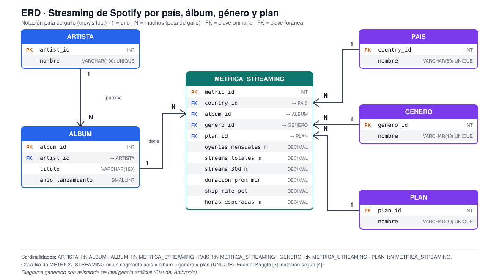

# Actividad calificable · Corte 2 — Modelo, consulta y limpieza de datos

**Programa:** Ingeniería Industrial · **Asignatura:** Ciencia de Datos · **Periodo:** 2026-B
**Unidad 2 · Semana 9** · **Entrega:** individual (fork del repositorio de la clase) · **Valor:** 5.0

> Caso de trabajo: **Spotify — capacidad de streaming y curaduría regional** (el mismo caso de todo el curso). Esta entrega diseña el ERD del caso, limpia el conjunto de datos de Kaggle [1] con pandas, mide la calidad **antes y después**, y responde dos preguntas con consultas en pandas y en SQL (con MongoDB como alternativa NoSQL).

| Entregable | Archivo |
|---|---|
| ERD | [`diagrama-erd-corte2.svg`](diagrama-erd-corte2.svg) |
| Limpieza + consultas (cuaderno ejecutado) | [`limpieza-y-consultas.ipynb`](limpieza-y-consultas.ipynb) |
| Datos antes (original Kaggle) / después | [`data/spotify_raw.csv`](data/spotify_raw.csv) · [`data/spotify_limpio.csv`](data/spotify_limpio.csv) |

---

## 1. ERD de mi caso



*Fig. 1. ERD en notación pata de gallo [2]. Diagrama generado con asistencia de inteligencia artificial (Claude, Anthropic).*

El modelo tiene **6 entidades**. Cinco son catálogos (quién, qué, dónde y bajo qué plan) y una es la tabla de hechos donde se registran las métricas de streaming.

| Entidad | PK | FK | Atributos | Rol |
|---|---|---|---|---|
| **ARTISTA** | `artist_id` | Ninguna (catálogo independiente) | `nombre` | Quién publica |
| **ALBUM** | `album_id` | `artist_id` → ARTISTA | `titulo`, `anio_lanzamiento` | Qué se escucha |
| **PAIS** | `country_id` | Ninguna (catálogo independiente) | `nombre` | Dónde se consume |
| **GENERO** | `genero_id` | Ninguna (catálogo independiente) | `nombre` | Clasificación musical |
| **PLAN** | `plan_id` | Ninguna (catálogo independiente) | `nombre` (Free / Premium) | Tipo de suscripción |
| **METRICA_STREAMING** | `metric_id` | `country_id`, `album_id`, `genero_id`, `plan_id` | `oyentes_mensuales_m`, `streams_totales_m`, `streams_30d_m`, `duracion_prom_min`, `skip_rate_pct`, `horas_esperadas_m` | Hechos: un segmento país × álbum × género × plan |

| Relación | Cardinalidad | Lectura |
|---|---|---|
| ARTISTA — ALBUM | **1:N** | Un artista publica muchos álbumes; cada álbum pertenece a un artista |
| ALBUM — METRICA_STREAMING | **1:N** | Un álbum tiene muchas métricas (una por país, género y plan) |
| PAIS — METRICA_STREAMING | **1:N** | Un país aparece en muchas métricas |
| GENERO — METRICA_STREAMING | **1:N** | Un género aparece en muchas métricas |
| PLAN — METRICA_STREAMING | **1:N** | Un plan aparece en muchas métricas |

**Coherencia del diseño.** Las FK evitan repetir textos (por ejemplo el nombre del país) en cada fila de hechos, y la restricción `UNIQUE (country_id, album_id, genero_id, plan_id)` garantiza una sola fila por segmento. El género va en la tabla de hechos y no en `ALBUM` porque, en estos datos, un mismo álbum aparece con varios géneros. El notebook carga el resultado limpio en estas seis tablas con PK y FK [3] y restricciones `CHECK` (por ejemplo `streams_30d_m <= streams_totales_m`), y confirma que no hay violaciones de FK.

### 1.1 Decisiones de diseño (Semanas 6 a 8)

- **Sin relación N:M.** La Semana 6 resuelve las N:M con una tabla intermedia [3]. Aquí no hace falta porque el CSV ya viene agregado: cada fila es un segmento país × álbum × género × plan, y esa combinación es justamente la tabla de hechos. En un diseño con eventos de reproducción (ver Semana 6) la N:M usuario ↔ canción sí aparecería.
- **Relacional y no NoSQL.** Los datos son tabulares, con esquema estable, y las preguntas son agregaciones con filtro y JOIN; para eso el modelo relacional ofrece integridad con PK y FK [3], [4]. NoSQL aportaría flexibilidad que este caso no necesita (la sección 4 muestra la alternativa).
- **Normalización hasta 3FN.** Los textos repetidos (país, género, plan, artista, álbum) viven en un solo lugar y se referencian por FK [3], lo que evita anomalías de actualización.
- **Proceso ETL.** El flujo del cuaderno sigue la idea de la Semana 8: *Extract* (leer el CSV), *Transform* (limpieza documentada) y *Load* (cargar en las tablas del ERD con restricciones) [5].

---

## 2. Data & cleaning

*(English section — requirement of the activity.)*

The dataset is "Spotify Global Streaming Data (2024)" from Kaggle [1], a CSV with 500 rows and 12 columns that describe streaming metrics by country, artist, album, genre, release year and subscription plan (Free or Premium). I loaded it with pandas [6] and measured its quality before touching it: there are no missing values, no exact duplicates and no outliers, but every one of the 15 albums appears with 6 different release years. In addition, 26 rows repeat the same country–album–genre–plan segment, and 2 rows are impossible because the last-30-days streams exceed the total streams. The cleaning renamed the columns to snake_case, converted the five text columns to `category` and the year to `int16`, and gave each album a single release year (its most frequent one, which corrected 368 rows). It then dropped the 2 impossible rows and merged the 26 repeated segments by averaging their metrics, so the data went from 500 to 472 rows. I also found that the "hours streamed" column behaves like minutes (it is roughly streams × minutes, not divided by 60), so I kept it only as a reference and added a corrected `horas_esperadas_m` column. The first question asked which countries concentrate the recent demand of Premium users: Italy, South Africa and Mexico lead, but together they hold only 21.9% of the 24,142.6 million Premium streams of the last 30 days, which is close to the 15% a uniform split would give, so demand is spread across many countries. The second question asked which genres are skipped the most in albums released since 2022: R&B (23.72%) and Pop (23.51%) are skipped the most, while K-pop (15.62%) and Indie (16.46%) are skipped the least. Because the release years were imputed by the most frequent value and the genre field is noisy, this 8-point gap is only indicative and should not be read as proof.

---

## 3. Limpieza de datos: antes y después

La limpieza sigue las dimensiones de calidad del OVA de la Semana 9 (completitud, exactitud, consistencia, unicidad y vigencia) [7], la idea de que cada fila sea una observación y cada columna una variable [8], y el papel de la etapa *Transform* dentro de un proceso ETL [5]. Se parte del archivo original descargado de Kaggle [1], sin modificar.

### 3.1 Comparación antes / después

| Indicador | Antes | Después |
|---|---:|---:|
| Filas | 500 | **472** |
| Columnas | 12 | 13 (+`horas_esperadas_m`) |
| Valores nulos | 0 | 0 |
| Duplicados exactos | 0 | 0 |
| Álbumes con más de un año de lanzamiento | 15 de 15 (6 años cada uno) | **0** |
| Años de lanzamiento > 2024 (vigencia) | 0 | 0 |
| Outliers (regla 1.5 × IQR, 6 métricas) | 0 | 0 |
| Filas repetidas por segmento (país × álbum × género × plan) | 26 | **0** |
| Filas imposibles (streams 30 días > streams totales) | 2 | **0** |
| Celdas de texto con espacios sobrantes | 0 | 0 |
| Memoria | 170.5 KB | **32.8 KB** |

| Columna | Tipo antes | Tipo después |
|---|---|---|
| `pais`, `artista`, `album`, `genero`, `plan` | `str` | `category` |
| `anio_lanzamiento` | `int64` | `int16` |
| Métricas numéricas (6) | `float64` | `float64` |

### 3.2 Bitácora de transformaciones

| # | Dimensión | Paso | Resultado |
|---|---|---|---|
| 1 | Consistencia | Nombres de columna a `snake_case` | 12 columnas renombradas |
| 2 | Completitud | Nulos: imputar mediana (numéricas) o `Desconocido` (texto) | 0 nulos encontrados, 0 celdas modificadas |
| 3 | Consistencia | Quitar espacios y unificar formato (`plan` en Title) | 0 celdas con espacios |
| 4 | Consistencia | Corregir tipos | 5 columnas a `category`, año a `int16` |
| 5 | Unicidad | Duplicados exactos (`drop_duplicates`) | 0 eliminados |
| 6 | Consistencia | Un álbum = un solo año de lanzamiento (moda; en empate, el año más antiguo) | **368 filas corregidas** (15 álbumes con 6 años → 1 año; 3 con empate) |
| 7 | Vigencia | Años coherentes con un conjunto de 2024 (ninguno posterior) | 0 filas con año > 2024; años 2018–2023 |
| 8 | Exactitud | Outliers por regla 1.5 × IQR en las 6 métricas | 0 detectados; se documenta y se conservan los datos |
| 9 | Exactitud | Reglas de rango y coherencia (`streams_30d ≤ streams_totales`, skip 0–100, duración > 0) | **2 filas eliminadas** |
| 10 | Unicidad | Una fila por segmento país × álbum × género × plan | **26 filas repetidas consolidadas** (promedio de métricas) |
| 11 | Exactitud | Unidad de la columna de horas | `horas_esperadas_m = streams × min / 60`; la original se conserva como `horas_reportadas_m` |

### 3.3 Decisiones y hallazgos de calidad

- **Nulos, espacios y duplicados exactos: 0.** El archivo original no los trae; los pasos 2, 3 y 5 se dejaron aplicados (con resultado 0) para que el proceso sea reproducible con datos más sucios. Los cambios reales están en los pasos 4, 6, 9, 10 y 11.
- **Año de lanzamiento inconsistente.** Los 15 álbumes aparecen con 6 años distintos (2018–2023), algo imposible porque un álbum se lanza una sola vez. Se asignó a cada álbum su año más frecuente (en empate, el más antiguo), lo que corrigió 368 de las 500 filas. Es una regla de consistencia interna, no una verdad externa: tres álbumes (Austin, For All The Dogs y Nadie Sabe Lo Que Va a Pasar Mañana) empataron en la moda y se tomó el año más antiguo, y varios años resultantes no coinciden con la fecha real de lanzamiento. Por eso el año es **indicativo**, y la Pregunta 2 (que filtra por año) debe leerse con esa cautela.
- **Vigencia.** El conjunto corresponde a 2024 y los años de lanzamiento van de 2018 a 2023, así que ninguna fila tiene un año futuro. La columna `streams_30d_m` no trae fecha de corte, por lo que su actualidad no se puede verificar con estos datos.
- **Outliers.** La regla 1.5 × IQR no detectó valores atípicos en las 6 métricas; los rangos son acotados (por ejemplo, skip rate de 1.16 % a 39.97 %), por lo que no se eliminó ni se transformó nada.
- **Repetidos por segmento.** Las 26 filas repetidas no eran copias exactas (las métricas diferían). Se trataron como observaciones repetidas del mismo segmento y se promediaron para evitar contar dos veces un segmento.
- **Inconsistencia de unidad.** La mediana de *horas / (streams × minutos)* es 0.998, es decir, la columna se comporta como minutos. Si fueran horas reales el cociente sería cercano a 1/60 ≈ 0.017. Por eso las consultas usan streams y skip rate, y no la columna de horas original.

---

## 4. Herramientas del curso: SQL, MongoDB y pandas

La Semana 7 presenta tres herramientas centrales, cada una pensada para un tipo de dato y de tarea [4]. En esta entrega las tres responden las mismas preguntas del caso Spotify, así se ve en qué se parecen y en qué se diferencian.

| Herramienta | Modelo de datos | Cómo se consulta | Para qué se usa en esta entrega |
|---|---|---|---|
| **SQL** (SQLite / PostgreSQL) | **Tablas** relacionales con PK y FK, como las del ERD | `SELECT … FROM … WHERE … GROUP BY … ORDER BY`, con `JOIN` para unir tablas por sus claves [9] | Consultar los datos normalizados con integridad referencial (Preguntas 1 y 2) |
| **MongoDB** (NoSQL) | **Documentos** JSON dentro de una colección, sin esquema fijo | `find()` para filtrar y *pipeline* `aggregate()` con etapas (`$match`, `$group`, `$sort`, `$limit`) [10] | Mostrar la idea de consulta en NoSQL: un documento autocontenido por segmento, sin JOIN |
| **Python (pandas)** | **DataFrame** en memoria | `read_csv`, filtro booleano, `groupby` [6] | Cargar, limpiar y analizar el CSV (secciones 3 y 5) |

### 4.1 La misma consulta en las tres herramientas

Pregunta 1 (demanda Premium de los últimos 30 días por país), equivalencia etapa por etapa:

| Paso | SQL | MongoDB (pipeline) | pandas |
|---|---|---|---|
| Filtrar | `WHERE plan = 'Premium'` | `{"$match": {"plan": "Premium"}}` | `df[df["plan"] == "Premium"]` |
| Agrupar y sumar | `GROUP BY pais` + `SUM(streams_30d_m)` | `{"$group": {"_id": "$pais", "streams_30d_m": {"$sum": "$streams_30d_m"}}}` | `.groupby("pais")["streams_30d_m"].sum()` |
| Ordenar | `ORDER BY … DESC` | `{"$sort": {"streams_30d_m": -1}}` | `.sort_values(ascending=False)` |
| Limitar | `LIMIT 5` | `{"$limit": 5}` | `.head(5)` |

En MongoDB cada segmento del CSV limpio es un documento como este, que ya trae el país, el álbum, el género y el plan dentro (no hay tablas que unir):

```json
{"pais": "Argentina", "album": "1989 (Taylor's Version)", "genero": "Pop", "plan": "Free",
 "anio_lanzamiento": 2020, "streams_30d_m": 117.69, "skip_rate_pct": 32.71}
```

```python
# Pregunta 1 en MongoDB (se ejecuta en la sección 7 del cuaderno)
coleccion.aggregate([
    {"$match": {"plan": "Premium"}},
    {"$group": {"_id": "$pais", "streams_30d_m": {"$sum": "$streams_30d_m"}}},
    {"$sort": {"streams_30d_m": -1}},
    {"$limit": 5},
])
```

La sección 7 del cuaderno ejecuta esta consulta (y la de la Pregunta 2) sobre una colección de MongoDB simulada en memoria con `mongomock`, y comprueba con `assert_frame_equal` que el resultado es **idéntico** al de pandas y SQL.

### 4.2 Cuándo usar cada una en este caso

- **SQL** es el núcleo: los datos son tabulares, el esquema es estable y las preguntas son agregaciones con filtro y JOIN sobre tablas normalizadas con integridad (ver §1.1).
- **pandas** hace el trabajo previo y el análisis exploratorio: leer el CSV, limpiarlo con transformaciones documentadas y calcular resultados rápidos en memoria.
- **MongoDB** encajaría si los datos llegaran como JSON de forma variable (por ejemplo, la respuesta de una API con campos que cambian). Aquí solo se muestra como alternativa, porque duplicaría texto (país, género, plan) en cada documento, justo lo que la normalización evita.

---

## 5. Consultas y hallazgos

Ambas preguntas se resolvieron en **pandas y en SQL** sobre las tablas del ERD (y además en MongoDB, sección 4) y el cuaderno comprueba con `assert_frame_equal` que los **valores** coinciden, no solo el orden [4].

### 5.1 Pregunta 1 — ¿Qué países concentran la demanda reciente de usuarios Premium?

Filtro: `plan = 'Premium'`. Agregación: suma de `streams_30d_m` por país (demanda reciente, relevante para la capacidad de servidores del caso).

```python
(df[df["plan"] == "Premium"]
   .groupby("pais", observed=True)["streams_30d_m"].sum()
   .sort_values(ascending=False).head(5))
```

```sql
SELECT p.nombre AS pais, ROUND(SUM(m.streams_30d_m), 2) AS streams_30d_m
FROM metrica_streaming m
JOIN pais p  ON p.country_id = m.country_id
JOIN plan pl ON pl.plan_id   = m.plan_id
WHERE pl.nombre = 'Premium'
GROUP BY p.nombre
ORDER BY streams_30d_m DESC
LIMIT 5;
```

| # | País | Streams últimos 30 días (millones) |
|---:|---|---:|
| 1 | Italy | 1,901.34 |
| 2 | South Africa | 1,688.34 |
| 3 | Mexico | 1,685.91 |
| 4 | United Kingdom | 1,550.61 |
| 5 | Brazil | 1,429.94 |

**Hallazgo.** Italia lidera con 1,901 M de streams Premium en 30 días, pero la demanda **no está muy concentrada**: los tres primeros países suman 5,275.6 M de 24,142.6 M (**21.9 %**) entre 20 países, apenas por encima del 15 % que daría un reparto uniforme. Para la decisión de capacidad esto sugiere repartir la inversión en CDN entre varias regiones en lugar de reforzar un solo país.

### 5.2 Pregunta 2 — ¿Qué géneros se saltan más los oyentes en lanzamientos recientes?

Filtro: `anio_lanzamiento >= 2022`. Agregación: promedio de `skip_rate_pct` y conteo de segmentos por género.

```python
(df[df["anio_lanzamiento"] >= 2022]
   .groupby("genero", observed=True)
   .agg(skip_rate_prom=("skip_rate_pct", "mean"), segmentos=("skip_rate_pct", "size"))
   .sort_values("skip_rate_prom", ascending=False))
```

```sql
SELECT g.nombre AS genero,
       ROUND(AVG(m.skip_rate_pct), 2) AS skip_rate_prom,
       COUNT(*) AS segmentos
FROM metrica_streaming m
JOIN genero g ON g.genero_id = m.genero_id
JOIN album a  ON a.album_id  = m.album_id
WHERE a.anio_lanzamiento >= 2022
GROUP BY g.nombre
ORDER BY skip_rate_prom DESC;
```

| Género | Skip rate promedio (%) | Segmentos |
|---|---:|---:|
| R&B | 23.72 | 11 |
| Pop | 23.51 | 18 |
| Rock | 22.18 | 25 |
| Hip Hop | 21.82 | 21 |
| Jazz | 21.65 | 18 |
| EDM | 20.94 | 19 |
| Reggaeton | 20.55 | 21 |
| Classical | 18.52 | 25 |
| Indie | 16.46 | 19 |
| K-pop | 15.62 | 15 |

**Hallazgo.** El promedio general en lanzamientos recientes es 20.45 %. R&B y Pop se saltan unos 3 puntos por encima del promedio, y K-pop e Indie unos 4–5 puntos por debajo: la brecha entre extremos es de **8.1 puntos porcentuales**. Como señal preliminar para la curaduría regional, K-pop e Indie parecen retener mejor al oyente. Es un resultado **indicativo, no concluyente**: usa el año de lanzamiento imputado (§3.3), el campo de género es ruidoso y cada género tiene entre 11 y 25 segmentos, sin prueba estadística; además el promedio no está ponderado por streams.

### 5.3 Limitaciones

- Los segmentos por género son pocos (11 a 25) y las diferencias no se probaron estadísticamente; el hallazgo es descriptivo, no concluyente.
- El año de lanzamiento es imputado por moda (3 álbumes con empate), y la Pregunta 2 filtra por ese año.
- El skip rate se promedia sin ponderar por streams, por lo que un segmento pequeño pesa igual que uno grande.
- El conjunto de Kaggle es agregado y tiene 15 artistas y 15 álbumes; no permite concluir sobre el catálogo completo de la plataforma.
- El campo `genero` es ruidoso: cada álbum aparece con 9 o 10 géneros distintos (por ejemplo, un artista de pop aparece como K-pop). No hay una regla interna para corregirlo, así que se conservó tal como viene y las conclusiones por género deben leerse con cautela.

---

## 6. Cómo reproducirlo

```bash
pip install pandas numpy mongomock jupyter   # probado con pandas 3.x
jupyter notebook limpieza-y-consultas.ipynb   # ejecutar todas las celdas
```

El cuaderno lee `data/spotify_raw.csv` (el archivo original de Kaggle [1], sin modificar), escribe `data/spotify_limpio.csv` y no necesita conexión a internet. Para obtener el original:

```bash
kaggle datasets download atharvasoundankar/spotify-global-streaming-data-2024
# descomprimir y guardar el CSV como data/spotify_raw.csv
```

---

## 7. Referencias (formato IEEE)

[1] A. Soundankar, "Spotify Global Streaming Data (2024)," Kaggle, 2024. [Online]. Disponible: https://www.kaggle.com/datasets/atharvasoundankar/spotify-global-streaming-data-2024

[2] A. Watt and N. Eng, "Chapter 8: The Entity Relationship Data Model," in *Database Design*, 2nd ed. Victoria, BC, Canada: BCcampus, 2014. [Online]. Disponible: https://opentextbc.ca/dbdesign01/chapter/chapter-8-entity-relationship-model/

[3] Corporación Universitaria del Huila (CORHUILA), "Ciencia de Datos · Semana 6 · Modelamiento de datos," Objeto Virtual de Aprendizaje (OVA), Neiva, Colombia, 2026. [Online]. Disponible: https://code-corhuila.github.io/ova-web/2026-B/ciencia-datos/06-week/01-session/

[4] Corporación Universitaria del Huila (CORHUILA), "Ciencia de Datos · Semana 7 · Herramientas y lenguajes (SQL, NoSQL, Python)," Objeto Virtual de Aprendizaje (OVA), Neiva, Colombia, 2026. [Online]. Disponible: https://code-corhuila.github.io/ova-web/2026-B/ciencia-datos/07-week/01-session/

[5] Corporación Universitaria del Huila (CORHUILA), "Ciencia de Datos · Semana 8 · Conexión de datos: APIs, ETL y pipelines," Objeto Virtual de Aprendizaje (OVA), Neiva, Colombia, 2026. [Online]. Disponible: https://code-corhuila.github.io/ova-web/2026-B/ciencia-datos/08-week/01-session/

[6] W. McKinney, "Data structures for statistical computing in Python," in *Proc. 9th Python in Science Conf. (SciPy 2010)*, Austin, TX, USA, 2010, pp. 56–61, doi: 10.25080/Majora-92bf1922-00a. [Online]. Disponible: https://proceedings.scipy.org/articles/Majora-92bf1922-00a

[7] Corporación Universitaria del Huila (CORHUILA), "Ciencia de Datos · Semana 9 · Transformación y calidad de datos," Objeto Virtual de Aprendizaje (OVA), Neiva, Colombia, 2026. [Online]. Disponible: https://code-corhuila.github.io/ova-web/2026-B/ciencia-datos/09-week/01-session/

[8] H. Wickham, "Tidy data," *J. Stat. Softw.*, vol. 59, no. 10, pp. 1–23, 2014, doi: 10.18637/jss.v059.i10. [Online]. Disponible: https://www.jstatsoft.org/article/view/v059i10

[9] A. Watt and N. Eng, "Chapter 16: SQL Data Manipulation Language," in *Database Design*, 2nd ed. Victoria, BC, Canada: BCcampus, 2014. [Online]. Disponible: https://opentextbc.ca/dbdesign01/chapter/chapter-sql-dml/

[10] MongoDB, Inc., "Aggregation Pipeline," *MongoDB Manual*. [Online]. Disponible: https://www.mongodb.com/docs/manual/core/aggregation-pipeline/
